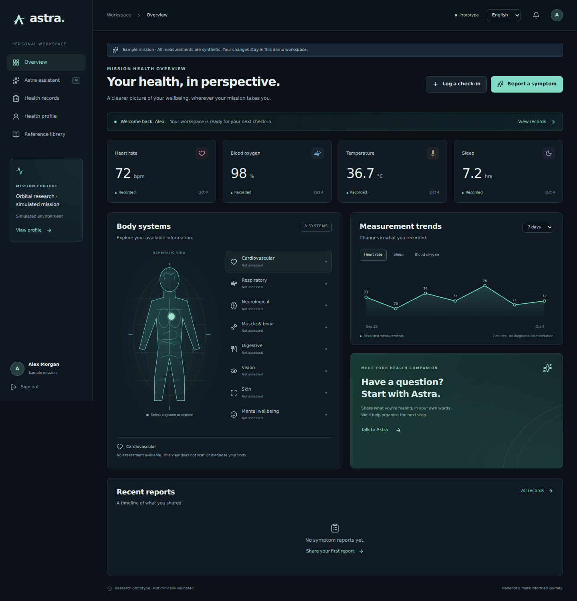

# Astra — astronaut health monitoring workspace

Working full-stack research prototype: Next.js 16 / React 19 / TypeScript frontend, FastAPI + Pydantic backend, SQLAlchemy persistence, SQLite for local development and PostgreSQL through Docker Compose.



[Landing page](docs/astra-landing.png) · [Mobile preview](docs/astra-mobile.png)

Deployment guide: [Render backend + PostgreSQL + Vercel frontend](DEPLOYMENT.md).

## Implemented

- Email/password registration and sign-in, hashed passwords, HttpOnly session cookies, logout, and per-user records.
- Editable health baseline: mission, history, conditions, medicines, allergies, equipment, medical contact and language.
- Manual check-ins for heart rate, oxygen saturation, temperature, blood pressure, sleep, mood and notes.
- Dashboard with recorded values, trend charts, body-system information availability and report alerts.
- Symptom reports with severity, duration and body-system context; persisted assistant responses and sources.
- Bounded assistant workflow: read the profile/history, check explicit warning phrases, optionally extract structured symptoms with an LLM, choose fixed escalation guidance, save the report. Obvious warning signs bypass provider calls. A provider failure falls back visibly to guided mode.
- Text input in six selectable languages. Main navigation is English/Bangla; fixed guidance is English/Bangla/Spanish. Other safety messages visibly fall back to English. Language accuracy is not clinically validated.
- Optional microphone recording and server-side transcription. Review/edit/confirm the transcript before submitting a health report. Voice is unavailable without a configured provider and user consent. Recording stops after 60 seconds; upload limit is 10 MB. Astra does not store audio.
- Record export, personal review acknowledgement, reference library, synthetic sample mission and responsive mobile UI.
- Same-origin backend proxy, source-controlled configuration examples, Dockerfiles, PostgreSQL Compose deployment, and backend regression tests.

## Run locally

Requirements: Node.js 24, Python 3.12 or later.

```bash
npm ci
python -m venv .venv
```

Linux/macOS:

```bash
.venv/bin/pip install -r backend/requirements.txt
cp .env.example .env.local
.venv/bin/uvicorn backend.main:app --host 127.0.0.1 --port 8000
```

Windows PowerShell (Python dependencies include Linux-only optional uvloop; use the minimal requirements file on Windows):

```powershell
.\.venv\Scripts\pip install -r backend/requirements-minimal.txt
Copy-Item .env.example .env.local
.\.venv\Scripts\python -m uvicorn backend.main:app --host 127.0.0.1 --port 8000
```

In a second terminal:

```bash
npm run dev
```

Open http://localhost:3000. FastAPI's interactive API documentation is at http://127.0.0.1:8000/docs. Both processes must be running. Never expose SQLite runtime files or commit private health data.

## Optional AI and voice

Copy `backend/.env.example` to `backend/.env`, configure your backend provider key securely, then start with:

```bash
.venv/bin/uvicorn backend.main:app --env-file backend/.env --host 127.0.0.1 --port 8000
```

Set `OPENAI_API_KEY`, `OPENAI_MODEL` and `TRANSCRIPTION_MODEL`. Model access depends on your account. No provider key is included. Real provider inference/transcription is not verified by tests; mock tests cover success/failure boundaries. Default models follow the official documentation checked during implementation and are configurable.

Enable external AI processing in the user's profile. Only then may symptom reports and selected relevant context be sent to the configured provider. Responses calls use `store=False`; this alone is not a provider-wide zero-retention guarantee. Configure the provider's data controls to meet your deployment requirements. Never expose a provider key through `NEXT_PUBLIC_` variables.

## Docker Compose

```bash
docker compose up --build
```

Open http://localhost:3000. The backend and database remain on the private Compose network. Set a strong `POSTGRES_PASSWORD` before exposing the deployment. For an HTTPS domain, set `APP_ORIGIN` to that exact origin and `COOKIE_SECURE=true`. Use durable storage, encrypted backups, and a HTTPS reverse proxy. Compose and PostgreSQL deployment are supplied but were not executed in the development environment.

For separate hosting, deploy the Next.js frontend and the FastAPI container separately, provide a durable PostgreSQL `DATABASE_URL`, and set the frontend's server-only `BACKEND_URL`. Keep the backend internal where possible.

## Verification

```bash
npm run lint
npm run typecheck
npm run build
.venv/bin/python -m pytest backend/test_app.py -q
```

Tests use an isolated in-memory database and no real provider calls. They cover session authentication, user isolation, input validation, exports, report acknowledgements, explicit multilingual warning phrases, basic negation, consent, unavailable transcription, provider failures and protection against fabricated extraction evidence.

Development verification passed: 28 backend tests, lint, type checking and production build. A Chromium browser check against the production frontend and backend verified signup, profile saving, check-in persistence after reload, symptom reporting, guided responses, Bangla escalation, review acknowledgement, JSON download, mobile navigation and account isolation. No browser runtime errors were observed. The proxy's origin protection and route allowlist were also checked. Preview images show synthetic demo records. Bengali and Devanagari fonts are bundled with the frontend.

## Medical and operational limits

This is a research prototype, not a clinically validated device, diagnostic system, approved spacecraft procedure or substitute for medical personnel. It cannot detect every disease. Body diagrams show data availability rather than organ health. Recorded values are not interpreted as normal. No live sensor feed, medical imaging, laboratory analysis, radiation dosimetry, ECG interpretation, autonomous medication prescribing or flight-surgeon portal is implemented.

The guided matcher is deliberately limited and can miss or misinterpret symptoms. AI extraction can also be wrong. No reassuring "all clear" result is generated. Unknown results require further assessment. The severity escalation is a conservative prototype policy, not a validated triage algorithm. Public NHS information is Earth-based; operational guidance needs flight-surgeon review, mission-specific protocol approval, validated translations and clinical testing. No clinical accuracy percentage is claimed.

The app runs with locally stored records when installed with its backend. Guided text responses work without a provider; offline voice transcription, network outage queuing and spacecraft telemetry are future work. Versioned database initialization and optional Ollama extraction are implemented; production still needs robust shared rate limiting, account recovery, retention controls and a reviewed security/clinical deployment process.

References: [NASA autonomous medical operations](https://www.nasa.gov/directorates/stmd/game-changing-development-program/autonomous-medical-operations-amo/), [NHS chest pain](https://www.nhs.uk/symptoms/chest-pain/), [NHS breathing symptoms](https://www.nhs.uk/symptoms/shortness-of-breath/), [NHS dizziness](https://www.nhs.uk/symptoms/dizziness/), [OpenAI structured outputs](https://developers.openai.com/api/docs/guides/structured-outputs).

The original pricing component remains in `src/components/pricing`; the default page on `main` is Astra. The repository name itself has not been changed.
